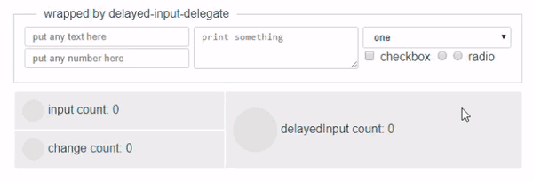

# vue-delayed-input-delegate

VueJs component.



Emits one "delayedInput" event for series of events followed by each other with short interval. For example, fast text printing will emit one "delayedInput" after short print pause. This is intended for "auto save" or "auto validate" logic.

It's not input itself - it is a wrapper element, listening for "input" or "change" events propagated by nested elements. So you can use one "delegate" for group of inputs.

## Demo
[mkant.ru/mink-js/vue-delayed-input-delegate/](http://mkant.ru/mink-js/vue-delayed-input-delegate/)
## Installation
```JavaScript
npm i vue-delayed-input-delegate --S
```
```JavaScript
import  delayedInputDelegate from  "vue-delayed-input-delegate";
```

## Usage

```html
<delayed-input-delegate @delayedInput="autoSave">
  <!-- put any input elements here ... -->
  <input v-model="title" />
  <textarea v-model="text"></textarea>
</delayed-input-delegate>
```
